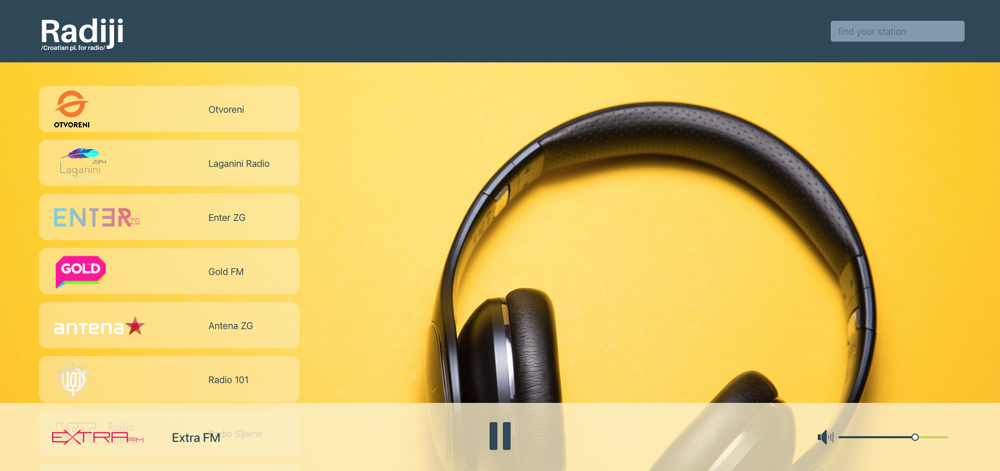

<!--
*** Thanks for checking out the Best-README-Template. If you have a suggestion
*** that would make this better, please fork the Radiji and create a pull request
*** or simply open an issue with the tag "enhancement".
*** Thanks again! Now go create something AMAZING! :D
***
***
***
*** To avoid retyping too much info. Do a search and replace for the following:
*** MarkoTadic96, Radiji, twitter_handle, email, Radiji, project_description
-->

<!-- PROJECT SHIELDS -->
<!--
*** I'm using markdown "reference style" links for readability.
*** Reference links are enclosed in brackets [ ] instead of parentheses ( ).
*** See the bottom of this document for the declaration of the reference variables
*** for contributors-url, forks-url, etc. This is an optional, concise syntax you may use.
*** https://www.markdownguide.org/basic-syntax/#reference-style-links
-->

[![Contributors][contributors-shield]][contributors-url]
[![Forks][forks-shield]][forks-url]
[![Stargazers][stars-shield]][stars-url]
[![Issues][issues-shield]][issues-url]
[![MIT License][license-shield]][license-url]

<!-- PROJECT LOGO -->
<br />
<p align="center">
  <a href="https://github.com/MarkoTadic96/Radiji">
    
  </a>
  <p align="center">
    Listen to radios from croatia
    <br />
    <a href="https://markotadic96.github.io/Radiji/"><strong>View Demo »</strong></a>
    <br />
    <br />
    <a href="https://github.com/MarkoTadic96/Radiji/issues">Report Bug</a>
    ·
    <a href="https://github.com/MarkoTadic96/Radiji/issues">Request Feature</a>
  </p>
</p>

<!-- TABLE OF CONTENTS -->
<details open="open">
  <summary><h2 style="display: inline-block">Table of Contents</h2></summary>
  <ol>
    <li>
      <a href="#about-the-project">About The Project</a>
      <ul>
        <li><a href="#built-with">Built With</a></li>
      </ul>
    </li>
    <li>
      <a href="#getting-started">Getting Started</a>
      <ul>
        <li><a href="#prerequisites">Prerequisites</a></li>
        <li><a href="#installation">Installation</a></li>
      </ul>
    </li>
    <li><a href="#contributing">Contributing</a></li>
    <li><a href="#license">License</a></li>
  </ol>
</details>

<!-- ABOUT THE PROJECT -->

## About The Project

[](images/screenshot.png)

This is a Web App that contains most popular croatian radios on one place, usable on a phone too.

### Built With

[![Typescript][ts-logo]](https://www.typescriptlang.org)
[![Typescript][react-logo]](https://reactjs.org)

<!-- GETTING STARTED -->

## Getting Started

To get a local copy up and running follow these simple steps.

### Prerequisites

- npm
  ```sh
  npm install npm@latest -g
  ```

### Installation

1. Clone the Radiji
   ```sh
   git clone https://github.com/MarkoTadic96/Radiji.git
   ```
2. Install NPM packages
   ```sh
   npm install
   ```

<!-- CONTRIBUTING -->

## Contributing

Contributions are what make the open source community such an amazing place to be learn, inspire, and create. Any contributions you make are **greatly appreciated**.

1. Fork the Project
2. Create your Feature Branch (`git checkout -b feature/AmazingFeature`)
3. Commit your Changes (`git commit -m 'Add some AmazingFeature'`)
4. Push to the Branch (`git push origin feature/AmazingFeature`)
5. Open a Pull Request

<!-- LICENSE -->

## License

Distributed under the MIT License. See `LICENSE` for more information.

<!-- MARKDOWN LINKS & IMAGES -->
<!-- https://www.markdownguide.org/basic-syntax/#reference-style-links -->

[contributors-shield]: https://img.shields.io/github/contributors/MarkoTadic96/Radiji.svg?style=flat
[contributors-url]: https://github.com/MarkoTadic96/Radiji/graphs/contributors
[forks-shield]: https://img.shields.io/github/forks/MarkoTadic96/Radiji.svg?style=flat
[forks-url]: https://github.com/MarkoTadic96/Radiji/network/members
[stars-shield]: https://img.shields.io/github/stars/MarkoTadic96/Radiji.svg?style=flat
[stars-url]: https://github.com/MarkoTadic96/Radiji/stargazers
[issues-shield]: https://img.shields.io/github/issues/MarkoTadic96/Radiji.svg?style=flat
[issues-url]: https://github.com/MarkoTadic96/Radiji/issues
[license-shield]: https://img.shields.io/github/license/MarkoTadic96/Radiji
[license-url]: https://github.com/MarkoTadic96/Radiji/blob/master/LICENSE?style=flat
[ts-logo]: https://img.shields.io/static/v1?label=&message=Typescript&color=007acc&logo=typescript&logoColor=white&style=flat
[react-logo]: https://img.shields.io/static/v1?label=&message=React&color=61DBFB&logo=react&logoColor=white&style=flat
